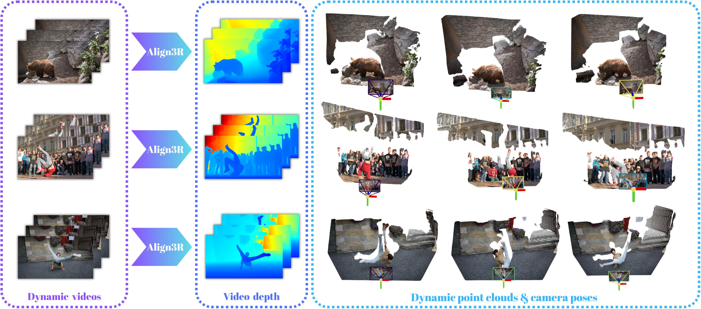

## ___***Align3R: Aligned Monocular Depth Estimation for Dynamic Videos***___


 &nbsp;
 <a href='https://arxiv.org/abs/2412.03079'></a> &nbsp;
 <a href='https://igl-hkust.github.io/Align3R.github.io/'></a> &nbsp;

[**Align3R: Aligned Monocular Depth Estimation for Dynamic Videos**]()
[*Jiahao Lu*\*](https://github.com/jiah-cloud),
[*Tianyu Huang*\*](https://scholar.google.com/citations?view_op=list_works&hl=en&user=nhbSplwAAAAJ),
[*Peng Li*](https://scholar.google.com/citations?user=8eTLCkwAAAAJ&hl=zh-CN),
[*Zhiyang Dou*](https://frank-zy-dou.github.io/),
[*Cheng Lin*](https://clinplayer.github.io/),
[*Zhiming Cui*](),
[*Zhen Dong*](https://dongzhenwhu.github.io/index.html),
[*Sai-Kit Yeung*](https://saikit.org/index.html),
[*Wenping Wang*](https://scholar.google.com/citations?user=28shvv0AAAAJ&hl=en),
[*Yuan Liu*](https://liuyuan-pal.github.io/)
Arxiv, 2024. 

**Align3R** estimates temporally consistent video depth, dynamic point clouds, and camera poses from monocular videos.
[](https://igl-hkust.github.io/Align3R.github.io/static/video/converted/Align3R_video.mp4)

## 🚀 Quick Start

### 🛠️ Installation
1. Clone this repo:
```bash
git clone git@github.com:jiah-cloud/Align3R.git
```
2. Install dependencies:
```bash
conda create -n align3r python=3.11 cmake=3.14.0
conda activate align3r 
conda install pytorch torchvision pytorch-cuda=12.1 -c pytorch -c nvidia  # use the correct version of cuda for your system
pip install -r requirements.txt
# Optional: you can also install additional packages to:
# - add support for HEIC images
# - add pyrender, used to render depthmap in some datasets preprocessing
# - add required packages for visloc.py
pip install -r requirements_optional.txt
```
3. Compile the cuda kernels for RoPE (as in CroCo v2):
```bash
cd croco/models/curope/
python setup.py build_ext --inplace
cd ../../../
```
4. Install the monocular depth estimation model [Depth Pro](https://github.com/apple/ml-depth-pro) and [Depth Anything V2](https://github.com/DepthAnything/Depth-Anything-V2):
```bash
# Depth Pro
cd third_party/ml-depth-pro
pip install -e .
source get_pretrained_models.sh
# Depth Anything V2
pip install transformers==4.41.2
```

5. Download the corresponding model weights:
```bash
# DUSt3R
wget https://download.europe.naverlabs.com/ComputerVision/DUSt3R/DUSt3R_ViTLarge_BaseDecoder_512_dpt.pth

# Align3R
gdown --fuzzy https://drive.google.com/file/d/1-qhRtgH7rcJMYZ5sWRdkrc2_9wsR1BBG/view?usp=sharing
gdown --fuzzy https://drive.google.com/file/d/1PPmpbASVbFdjXnD3iea-MRIHGmKsS8Vh/view?usp=sharing

# Depth Pro
cd third_party/ml-depth-pro
source get_pretrained_models.sh

# Raft
gdown --fuzzy https://drive.google.com/file/d/1KJxQ7KPuGHlSftsBCV1h2aYpeqQv3OI-/view?usp=drive_link -O models/
```


### 🔧 Dataset Preparation
To train Align3R, you should download the following dataset:

* [SceneFlow](https://lmb.informatik.uni-freiburg.de/resources/datasets/SceneFlowDatasets.en.html) (Includes FlyingThings3D, Driving & Monkaa)
* [VKITTI](https://europe.naverlabs.com/research/computer-vision/proxy-virtual-worlds-vkitti-2/)
* [TartanAir](https://github.com/castacks/tartanair_tools.git)
* [Spring](https://darus.uni-stuttgart.de/dataset.xhtml?persistentId=doi:10.18419/darus-3376)
* [PointOdyssey](https://huggingface.co/datasets/aharley/pointodyssey)

Then use the following script to preprocess the training datasets:
```bash
bash datasets_preprocess/preprocess_trainingset.sh
```
After preprocessing, our folder structure is as follows:

```shell
├── data
    ├── PointOdyssey_proc
    │   ├── train
    │   └── val
    ├── spring_proc
    │   └── train
    ├── Tartanair_proc
    ├── vkitti_2.0.3_proc
    └── SceneFlow
        ├── FlyingThings3D_proc
        │   ├── TRAIN
        │   │   ├── A
        │   │   ├── B
        │   │   └── C
        │   └── TEST
        │       ├── A
        │       ├── B
        │       └── C
        ├── Driving_proc
        │   ├── 35mm_focallength
        │   └── 15mm_focallength
        └── Monkaa_proc
```
To evaluate, you should download the following dataset: 

* [Sintel](http://sintel.is.tue.mpg.de/depth)
* [DAVIS](https://davischallenge.org/davis2016/code.html)
* [Bonn](https://www.ipb.uni-bonn.de/html/projects/rgbd_dynamic2019/rgbd_bonn_dataset.zip)
* [TUM dynamics](https://cvg.cit.tum.de/rgbd/dataset/) (Dynamic Objects: freiburg3)

Our folder structure is as follows:
```shell
├── data
    ├── bonn 
    │   └── rgbd_bonn_dataset
    ├── davis
    │   └── DAVIS
    │       ├── JPEGImages
    │       │   ├── 480P
    │       │   └── 1080P
    │       ├── Annotations
    │       │   ├── 480P
    │       │   └── 1080P
    │       └── ImageSets
    │           ├── 480P
    │           └── 1080P
    ├── MPI-Sintel
    │   ├── MPI-Sintel-training_images
    │   │   └── training
    │   │       └── final
    │   └── MPI-Sintel-depth-training
    │       └── training
    │           ├── camdata_left
    │           └── depth
    └── tum

```
To generate monocular depth maps, you should use the following script:
```shell
cd third_party/ml-depth-pro
bash infer.sh
```
### 🌟 Training
Please download the pretrained DUSt3R [weight](https://download.europe.naverlabs.com/ComputerVision/DUSt3R/DUSt3R_ViTLarge_BaseDecoder_512_dpt.pth) before training.
```bash
bash train.sh
```

### 🎇 Evaluation 
#### Video Depth
```bash
bash depth_test.sh
```
Please change the _--dust3r_dynamic_model_path_, _--output_postfix_, _--dataset_name_, _--depth_prior_name_.
##### Sintel
```bash
# Depth Pro
CUDA_VISIBLE_DEVICES='0' python tool/depth_test.py --dust3r_dynamic_model_path="align3r_depthpro.pth" --align_with_lad  --depth_max=70 --depth_prior_name=depthpro --dataset_name=sintel --eval --output_postfix="results/sintel_depth_ours_depthpro" 

# Depth Anything V2
CUDA_VISIBLE_DEVICES='0' python tool/depth_test.py --dust3r_dynamic_model_path="align3r_depthanything.pth" --align_with_lad  --depth_max=70 --depth_prior_name=depthanything --dataset_name=sintel --eval --output_postfix="results/sintel_depth_ours_depthanything" 
```

##### PointOdyssey
```bash
# Depth Pro
CUDA_VISIBLE_DEVICES='0' python tool/depth_test.py --dust3r_dynamic_model_path="align3r_depthpro.pth" --align_with_lad  --depth_max=70 --depth_prior_name=depthpro --dataset_name=PointOdyssey --eval --output_postfix="results/PointOdyssey_depth_ours_depthpro" 

# Depth Anything V2
CUDA_VISIBLE_DEVICES='0' python tool/depth_test.py --dust3r_dynamic_model_path="align3r_depthanything.pth" --align_with_lad  --depth_max=70 --depth_prior_name=depthanything --dataset_name=PointOdyssey --eval --output_postfix="results/PointOdyssey_depth_ours_depthanything" 
```
##### FlyingThings3D
```bash
# Depth Pro
CUDA_VISIBLE_DEVICES='0' python tool/depth_test.py --dust3r_dynamic_model_path="align3r_depthpro.pth" --align_with_lad  --depth_max=70 --depth_prior_name=depthpro --dataset_name=FlyingThings3D --eval --output_postfix="results/FlyingThings3D_depth_ours_depthpro" 

# Depth Anything V2
CUDA_VISIBLE_DEVICES='0' python tool/depth_test.py --dust3r_dynamic_model_path="align3r_depthanything.pth" --align_with_lad  --depth_max=70 --depth_prior_name=depthanything --dataset_name=FlyingThings3D --eval --output_postfix="results/FlyingThings3D_depth_ours_depthanything" 
```
##### Bonn
```bash
# Depth Pro
CUDA_VISIBLE_DEVICES='0' python tool/depth_test.py --dust3r_dynamic_model_path="align3r_depthpro.pth" --align_with_lad  --depth_max=70 --depth_prior_name=depthpro --dataset_name=bonn --eval --output_postfix="results/Bonn_depth_ours_depthpro" 

# Depth Anything V2
CUDA_VISIBLE_DEVICES='0' python tool/depth_test.py --dust3r_dynamic_model_path="align3r_depthanything.pth" --align_with_lad  --depth_max=70 --depth_prior_name=depthanything --dataset_name=bonn --eval --output_postfix="results/Bonn_depth_ours_depthanything" 
```
##### TUM dynamics
```bash
# Depth Pro
CUDA_VISIBLE_DEVICES='0' python tool/depth_test.py --dust3r_dynamic_model_path="align3r_depthpro.pth" --align_with_lad  --depth_max=70 --depth_prior_name=depthpro --dataset_name=tum --eval --output_postfix="results/tum_depth_ours_depthpro" 

# Depth Anything V2
CUDA_VISIBLE_DEVICES='0' python tool/depth_test.py --dust3r_dynamic_model_path="align3r_depthanything.pth" --align_with_lad  --depth_max=70 --depth_prior_name=depthanything --dataset_name=tum --eval --output_postfix="results/tum_depth_ours_depthanything"
```

#### Camera Pose
We find that the flow loss proposed in MonST3R is crucial for pose estimation, so we have incorporated it into our implementation. We sincerely thank the authors of MonST3R for sharing the code for their outstanding work.
```bash
bash pose_test.sh
```
Please change the _--dust3r_dynamic_model_path_, _--output_postfix_, _--dataset_name_, _--depth_prior_name_.
##### Sintel
```bash
# Depth Pro
CUDA_VISIBLE_DEVICES='0' python tool/pose_test.py --dust3r_dynamic_model_path="align3r_depthpro.pth" --output_postfix="results/sintel_pose_ours_depthpro" --dataset_name=sintel --depth_prior_name=depthpro --start_frame=0 --interval_frame=30 --mode=eval_pose --scene_graph_type=swinstride-5-noncyclic

# Depth Anything V2
CUDA_VISIBLE_DEVICES='0' python tool/pose_test.py --dust3r_dynamic_model_path="align3r_depthanything.pth" --output_postfix="results/sintel_pose_ours_depthanything" --dataset_name=sintel --depth_prior_name=depthanything --start_frame=0 --interval_frame=30 --mode=eval_pose --scene_graph_type=swin-5-noncyclic
```
##### Bonn
```bash
# Depth Pro
CUDA_VISIBLE_DEVICES='0' python tool/pose_test.py --dust3r_dynamic_model_path="align3r_depthpro.pth" --output_postfix="results/bonn_pose_ours_depthpro" --dataset_name=bonn --depth_prior_name=depthpro --start_frame=0 --interval_frame=30 --mode=eval_pose --scene_graph_type=swin-5-noncyclic

# Depth Anything V2
CUDA_VISIBLE_DEVICES='0' python tool/pose_test.py --dust3r_dynamic_model_path="align3r_depthanything.pth" --output_postfix="results/bonn_pose_ours_depthanything" --dataset_name=bonn --depth_prior_name=depthanything --start_frame=0 --interval_frame=30 --mode=eval_pose --scene_graph_type=swin-5-noncyclic
```
##### TUM dynamics
```bash
# Depth Pro
CUDA_VISIBLE_DEVICES='0' python tool/pose_test.py --dust3r_dynamic_model_path="align3r_depthpro.pth" --output_postfix="results/tum_pose_ours_depthpro" --dataset_name=tum --depth_prior_name=depthpro --start_frame=0 --interval_frame=30 --mode=eval_pose --scene_graph_type=swin-5-noncyclic

# Depth Anything V2
CUDA_VISIBLE_DEVICES='0' python tool/pose_test.py --dust3r_dynamic_model_path="align3r_depthanything.pth" --output_postfix="results/tum_pose_ours_depthanything" --dataset_name=tum --depth_prior_name=depthanything --start_frame=0 --interval_frame=30 --mode=eval_pose --scene_graph_type=swin-5-noncyclic
```

### 🎥 Visualization
Please use the `viser` to visualize the results, you can acquire the code from [MonST3R](https://github.com/Junyi42/viser.git). Thanks for their excellent work!
```bash
python viser/visualizer_monst3r.py --data path/dataset/video --init_conf --fg_conf_thre 1.0  --no_mask
```
### 📜 Citation

If you find our work useful, please cite:

```bibtex

```

### 🤝 Acknowledgements
Our code is based on [DUSt3R](https://github.com/naver/dust3r), [MonST3R](https://github.com/Junyi42/monst3r), [Depth Pro](https://github.com/apple/ml-depth-pro) and [Depth Anything V2](https://github.com/DepthAnything/Depth-Anything-V2). Our visualization code can acquired from [MonST3R](https://github.com/Junyi42/viser.git). We thank the authors for their excellent work!
